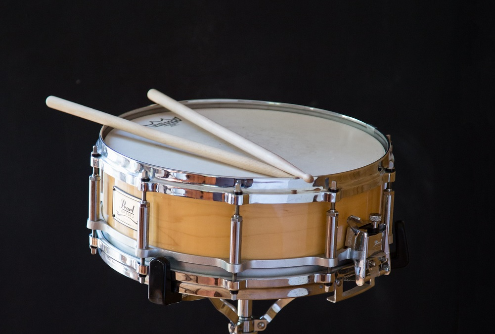
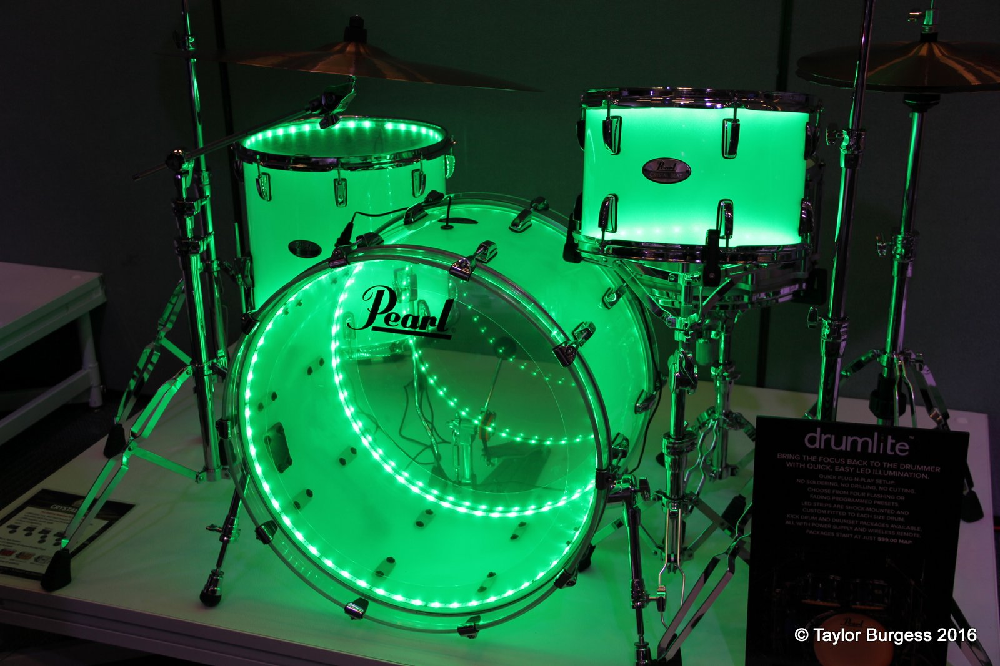
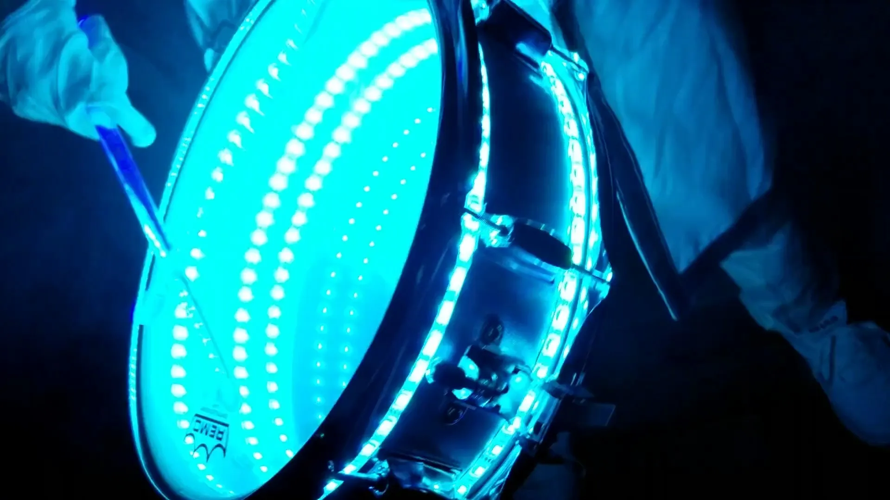
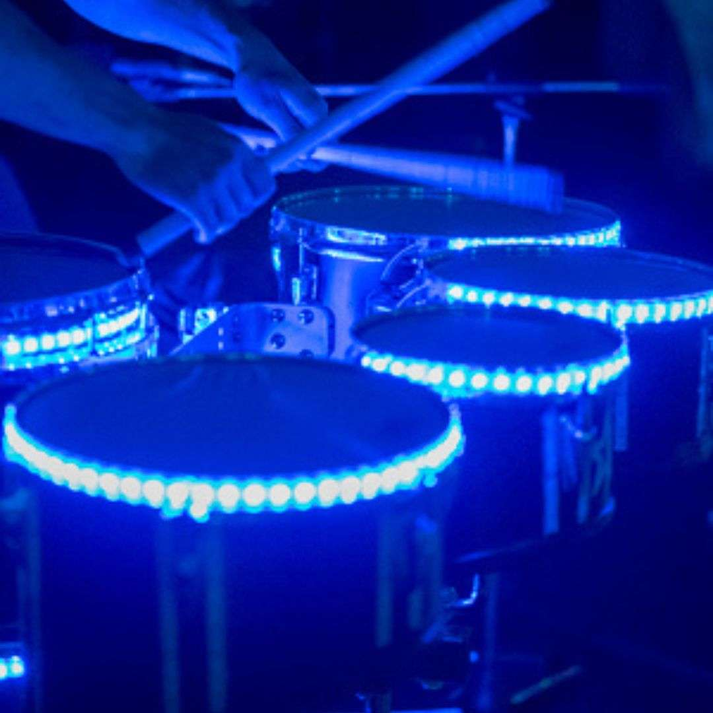

# 2526_Maker_Drumled

### Description :
 
Le projet consiste à mettre des leds sur la caisse-claire d’une batterie. Ces led s’allumeraient lorsque la caisse-claire reçoit un coup. De plus, il y aurait un encodeur permettant de choisir la couleur de l’éclairage.
Le projet a pour but d’être amovible ; c’est-à-dire qu’il puisse être ajouté puis retiré de la caisse claire. 
Une partie conception 3D est envisagée afin de mettre le projet sur le contour de la caisse claire sans gêner les frappes du batteur, et qu’il n’y ait pas besoin de démonter les peaux pour insérer les leds. Ainsi, nous évitons de faire des trous dans une caisse claire afin de relier l’encodeur.

### Quelques images d'une caisse claire et de ce que l'on trouve actuellement sur le marché :

#### Exemple de caisse claire :
Nous pouvons voir le fût sur lequel l'on pourra fixer le système et le déclencheur que l'on ne doit pas gêner en revanche. 

#### Système d'éclairage existant :

#####

#####

