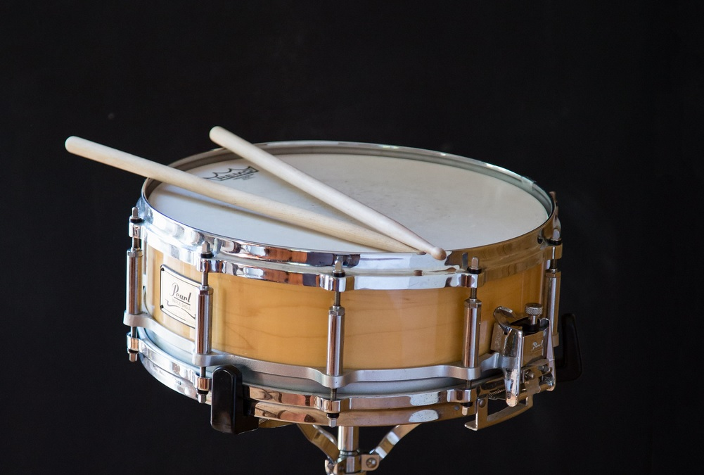
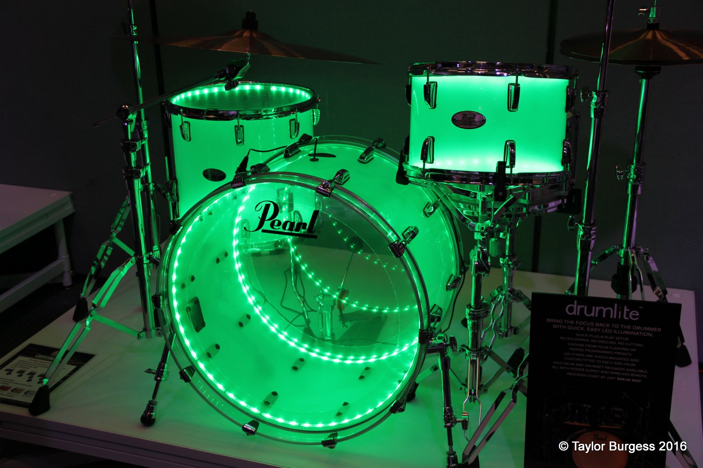
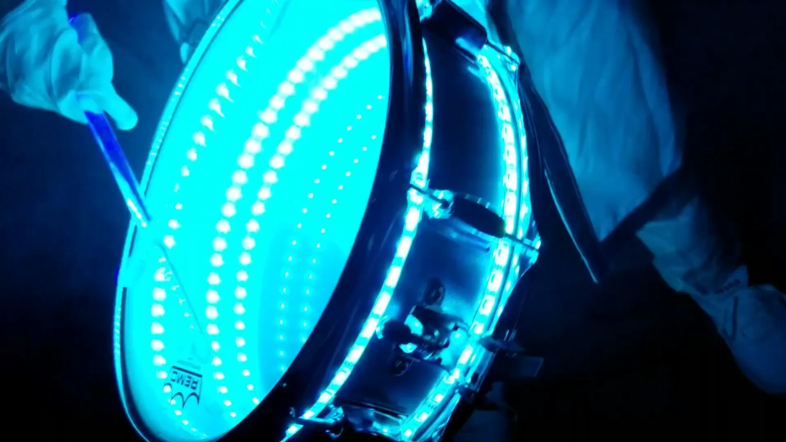
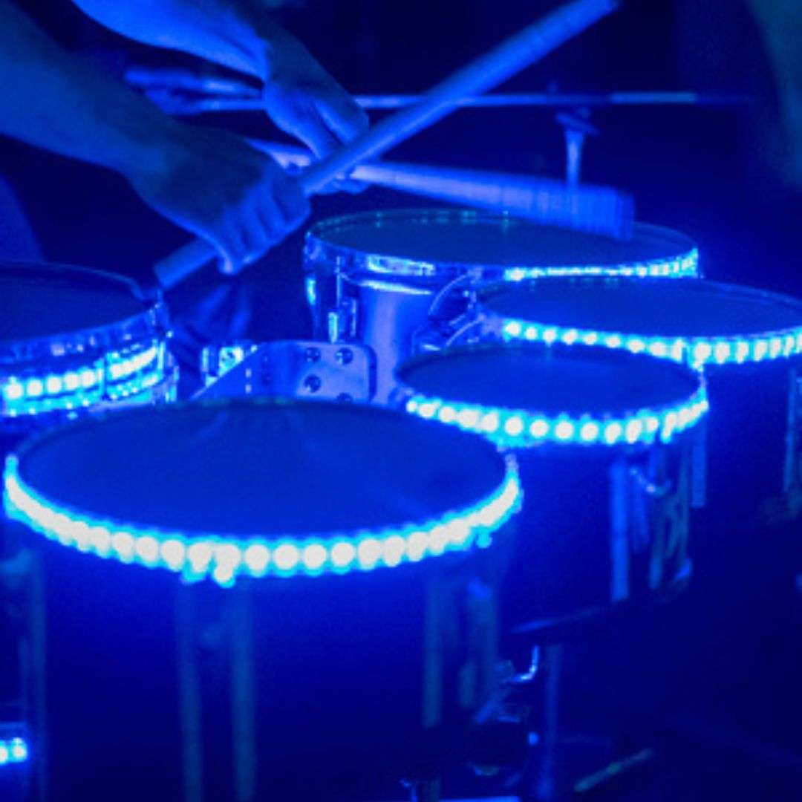
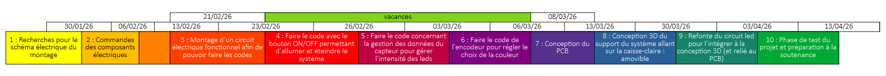

# 2526_Maker_Drumled

## Elise Firmin

### Description :
 
Le projet consiste à mettre des leds sur la caisse-claire d’une batterie. Ces led s’allumeraient lorsque la caisse-claire reçoit un coup. De plus, il y aurait un encodeur permettant de choisir la couleur de l’éclairage.
Le projet a pour but d’être amovible ; c’est-à-dire qu’il puisse être ajouté puis retiré de la caisse claire. 
Une partie conception 3D est envisagée afin de mettre le projet sur le contour de la caisse claire sans gêner les frappes du batteur, et qu’il n’y ait pas besoin de démonter les peaux pour insérer les leds. Ainsi, nous évitons de faire des trous dans une caisse claire afin de relier l’encodeur.

### Quelques images d'une caisse claire et de ce que l'on trouve actuellement sur le marché :

#### Exemple de caisse claire :
Nous pouvons voir le fût sur lequel l'on pourra fixer le système et le déclencheur que l'on ne doit pas gêner en revanche. 

#### Système d'éclairage existant :

#####

#####

### Rétroplanning du projet :

Se référer à la partie "Projects" avec le nom "Retroplanning".

## Mécanique :

Il a fallu faire attention que le timbre puisse s'enclencher et se déclencher sans problème. Aussi, ne pas supperposer la partie mécanique aux pièces mécaniques de la caisse-claire elle-même. L'imprimante 3D a été choisie de façon à qu'elle ait un plateau suffisamment grand pour imprimer cette pièce mécanique. 

La partie mécanique se fait en 3 parties :

- 2 parties pour l'anneau autour de la caisse claire, qui s'aimante afin que le tout tienne autour de la caisse-claire. Les aimants sont choisis assez puissants (12kg minimum conseillé), et le tout est assez solide pour ne pas glisser vers le bas. L'une des moitiés d'anneau est adaptée pour recevoir le pcb qui se fixe à l'aide de vis et d'un fer à souder chaud. 

- Le support de la batterie, qui possède 4 trous afin de pouvoir le fixer à l'anneau autour de la caisse claire, à l'aide de vis et d'un fer à soudé chaud.

## Le code :

Le seuil du capteur est à régler dans le code du projet. Le code est séparé en plusieurs parties avec notamment les fonctions importantes qui sont exécutées dans la boucle du main. Un fichier concerne l'acquisition du capteur, un autre les données envoyées à la bande neopixel selon la couleur dirigée par le bouton hardware, et l'acquisition du capteur. 

## La batterie :

Malheureusement, la batterie construite ne permet pas de gérer les appels de courants du circuit, en revanche, en branche une alimentation électrique, le projet est fonctionnel. Il faut changer le composant qui permet de rguler les batteries qui sont en série pour en prendre un plus performant, ou bien utiliser une batterie qui possède une seule cellule est une autre soluton. 

## Le hardware

Plusieurs connectiques de composants ont été adaptées pour avoir des connectiques plus petites et réduire la taille du pcb. Notamment la connectique du ruban de led neopixels pour la convertir en un connecteur jmc de petite taille. 

De plus, lors des tests du projet, le maintien du bouton reset était nécessaire pour la compilatiion du code ; ainsi, la résistance R3 du pcb est inutile : elle s'enlève très facilement du pcb à l'aide d'un coupe-ongle par exemple. Ou bien, sans fer à souder, la température d'un briquet étant de 800°C à 1000°C, cela peut être tenté ; mais attention au risque de brûlure. 

La petite taille du pcb permet un poids léger. 

Le PCB a été conçu à l'aide du logiciel KiCad.

## Piste d'amélioration du projet :

Le projet pourrait être amélioré grâce à des effets codés comme un chazer par exmple, puis un bouton hardware associé. 
De plus, il pourrait être pertinent de mettre un bouton qui permettrait en appuyant 4 fois dessus par l'utilisateur de déterminer un BPM et que les led ne s'allument plus à chaque coup cette fois ci, mais à chaque temps, ce qui constiturait une aide pour le batteur pour conserver le tempo.
En mêlant cette dernière idée avec le projet initial, et étendu à la batterie tout entière, cela donnerait l'accès à des personnes mal entendante à cet instrument, que ce soit une sourdité partiel ou complète. 
